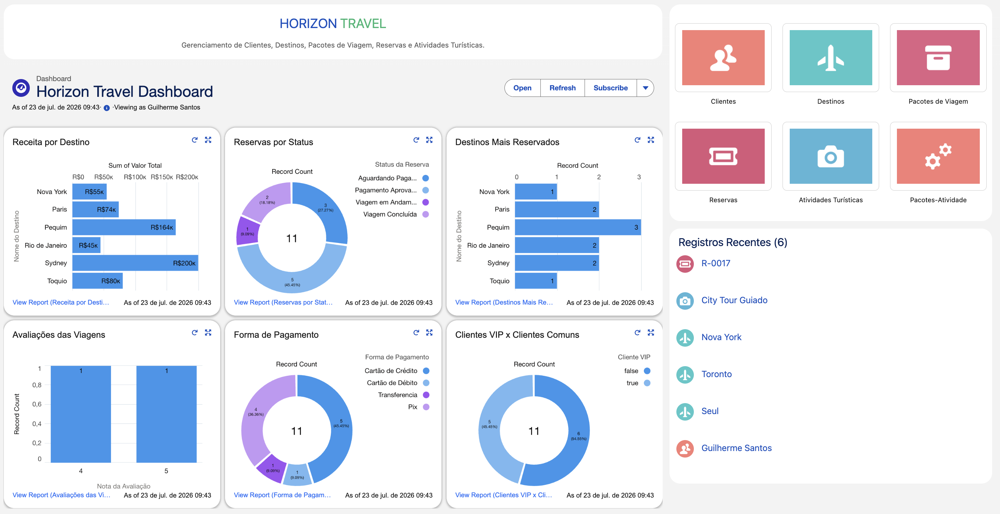
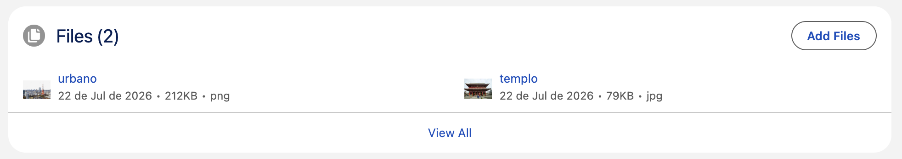
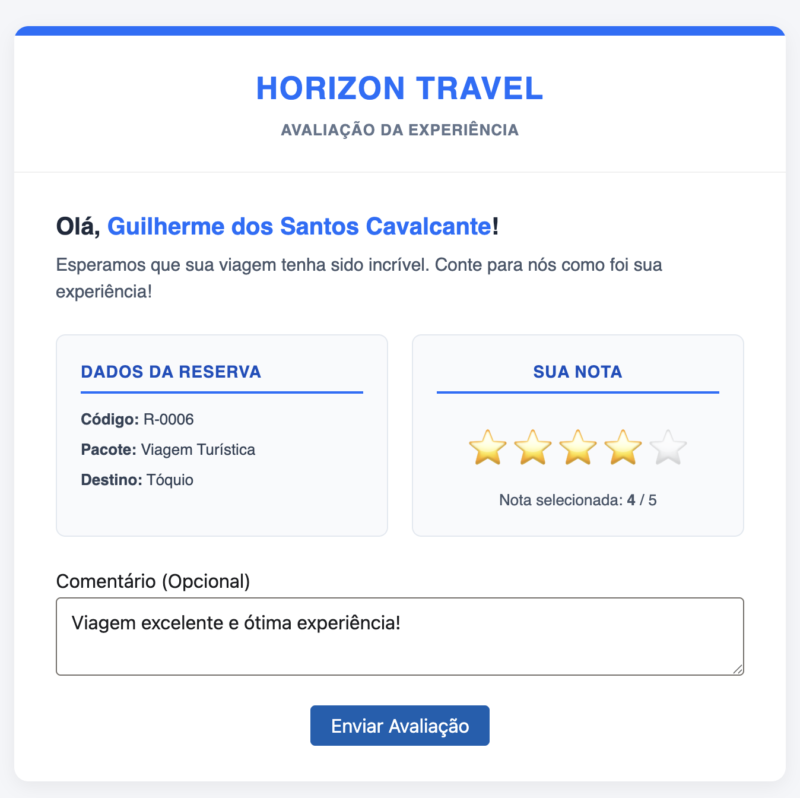
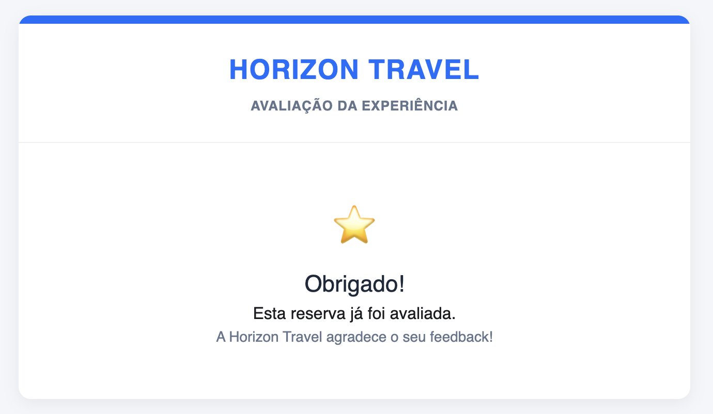
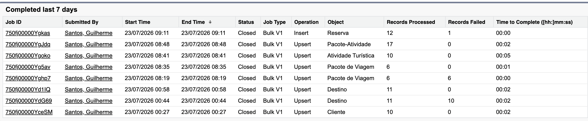
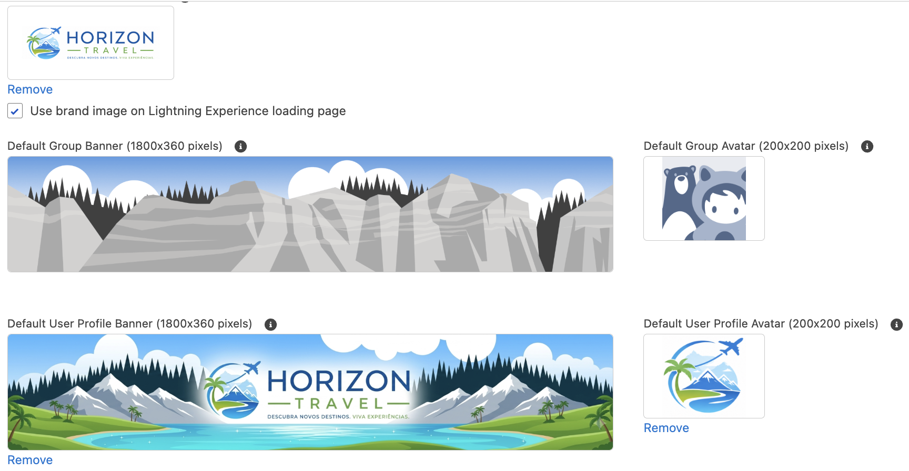
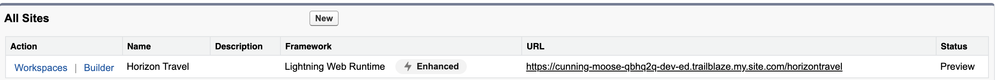

# Horizon Travel

A Horizon Travel é uma agência de viagens que busca modernizar seus processos e centralizar o gerenciamento de clientes, destinos, pacotes turísticos, reservas e atividades em uma única plataforma. Para isso, a empresa adotará o Salesforce como seu sistema de CRM, permitindo uma gestão mais eficiente das informações, automação de processos e melhor acompanhamento das operações.

- [Regras de Negócio](#regras-de-negócio)
- [Requisitos](#requisitos)
- [Mapeamento de Objetos](#mapeamento-de-objetos)
- [Funcionalidades](#funcionalidades)
  - [Components](#components)
  - [Field Dependencies](#field-dependencies)
  - [Formulas](#formulas)
  - [Validation Rules](#validation-rules)
  - [Record-Triggered Flows](#record-triggered-flows)
  - [Apex](#apex)
  - [Triggers](#triggers)
  - [LWC](#lwc)
- [Configurações](#configurações)
  - [Carga de Dados](#carga-de-dados)
  - [Themes and Branding](#themes-and-branding)
  - [Digital Experiences](#digital-experiences)

# Regras de Negócio

- Um Cliente pode possuir várias Reservas, porém cada Reserva pertence a um único Cliente.
- Um Destino pode possuir vários Pacotes de Viagem, porém cada Pacote de Viagem pertence a um único Destino.
- Um Pacote de Viagem pode estar associado a várias Atividades Turísticas, e uma Atividade Turística pode estar associada a vários Pacotes de Viagem.
- O sistema deve permitir a seleção apenas de Destinos com `Ativo` marcado.
- O sistema deve limitar os `Países` de acordo com o `Continente` selecionado.
- A `Data de Nascimento` do Cliente não pode ser maior que a data atual.
- O `CPF` do Cliente deve possuir um formato válido e ser validado pelo algoritmo oficial dos dígitos verificadores.
- A `Duração (Dia)` do Pacote de Viagem deve ser maior que zero.
- O `Preço Base` do Pacote de Viagem deve ser maior que zero.
- O `Custo Adicional` da Atividade Turística deve ser maior que zero.
- Um Pacote de Viagem não pode possuir a mesma Atividade Turística mais de uma vez.
- O custo da Atividade Turística deve ser desconsiderado quando ela estiver marcada como `Inclusa por Padrão`.
- Um Pacote de Viagem com `Classe` igual a `VIP` só pode ser reservado por Clientes marcados como `Cliente VIP`.
- Um Pacote de Viagem que exige `Passaporte` só pode ser reservado por Clientes que possuam `Passaporte`.
- A `Data da Viagem` não pode ser anterior à data e hora atuais.
- O `Percentual de Desconto` da Reserva deve ser definido de acordo com a `Quantidade de Pessoas`.
- O `Valor do Desconto` deve ser calculado com base no `Percentual de Desconto`.
- O `Valor Total` da Reserva deve considerar o desconto aplicado.
- Quando o `Status da Reserva` for alterado para `Pagamento Aprovado`, o Cliente deve receber um e-mail com os detalhes da Reserva.
- Quando o `Status da Reserva` for alterado para `Viagem Concluída`, o Cliente deve receber um e-mail contendo um link para avaliação da experiência da viagem.
- A avaliação da experiência da viagem só pode ser realizada por meio da página disponibilizada após a conclusão da viagem.

# Requisitos

- O sistema deve permitir o cadastro, edição, consulta e exclusão de Clientes, Destinos, Pacotes de Viagem, Reservas e Atividades Turísticas.
- O sistema deve disponibilizar um espaço para armazenamento e visualização de imagens dos Destinos.
- O sistema deve calcular automaticamente a `Idade` do Cliente.
- O sistema deve calcular automaticamente o `Preço Total` do Pacote de Viagem sempre que houver alterações nas Atividades associadas (criação, atualização ou exclusão).
- O sistema deve recalcular o `Preço Total` dos Pacotes de Viagem quando uma Atividade Turística utilizada for excluída.
- O sistema deve calcular automaticamente o `Percentual de Desconto`, o `Valor do Desconto` e o `Valor Total` da Reserva.
- O sistema deve impedir a criação de registros duplicados de `Pacote-Atividade` para um mesmo Pacote de Viagem.
- O sistema deve disponibilizar uma página para que o Cliente avalie sua experiência de viagem por meio de uma nota e um comentário.
- O sistema deve permitir visualizar informações gerais da aplicação por meio da página inicial.
- O sistema deve permitir a importação de dados dos objetos por meio de arquivos CSV.

# Mapeamento de Objetos

## Cliente

Armazena as informações dos clientes da Horizon Travel, incluindo dados pessoais e informações utilizadas para o gerenciamento do relacionamento com a agência.

| Campo              | Tipo               | Tamanho | Detalhes         |
| ------------------ | ------------------ | ------- | ---------------- |
| Nome Completo      | Record Name (Text) | 80      | Required         |
| CPF                | Text               | 14      | Required, Unique |
| Email              | Email              | -       | Required, Unique |
| Tem Passaporte     | Checkbox           | -       | Unchecked        |
| Cliente VIP        | Checkbox           | -       | Unchecked        |
| Data de Nascimento | Date               | -       | Required         |
| Idade              | Formula (Number)   | -       | -                |

## Destino

Representa os destinos turísticos oferecidos pela agência, contendo informações geográficas e detalhes relevantes para a comercialização dos pacotes.

| Campo             | Tipo               | Tamanho | Detalhes  |
| ----------------- | ------------------ | ------- | --------- |
| Nome do Destino   | Record Name (Text) | 80      | Required  |
| Continente        | Picklist           | -       | Required  |
| País              | Picklist           | -       | Required  |
| Ativo             | Checkbox           | -       | Unchecked |
| Pontos Turísticos | Text Area (Long)   | 2000    | -         |

## Pacote de Viagem

Armazena os pacotes de viagem disponibilizados pela agência, reunindo informações como destino, duração, preço e nível de luxo.

| Campo                 | Tipo               | Tamanho | Detalhes  |
| --------------------- | ------------------ | ------- | --------- |
| Nome do Pacote        | Record Name (Text) | 80      | -         |
| Destino               | Master-Detail      | -       | -         |
| Necessário Passaporte | Checkbox           | -       | Unchecked |
| Classe                | Picklist           | -       | Required  |
| Duração (Dia)         | Number             | 2       | Required  |
| Preço Base            | Currency           | 16-2    | Required  |
| Preço Total           | Currency           | 16-2    | -         |

## Reserva

Registra cada contratação de um pacote de viagem realizada por um cliente, incluindo informações sobre a reserva, seu status e o valor pago.

| Campo                   | Tipo                 | Tamanho | Detalhes |
| ----------------------- | -------------------- | ------- | -------- |
| ID                      | Record Name (Number) | -       | -        |
| Cliente                 | Master-Detail        | -       | -        |
| Pacote de Viagem        | Master-Detail        | -       | -        |
| Preço Total             | Pacote de Viagem     | -       | -        |
| Quantidade de Pessoas   | Number               | 2       | Required |
| Data da Viagem          | Date/Time            | -       | Required |
| Forma de Pagamento      | Picklist             | -       | Required |
| Status da Reserva       | Picklist             | -       | Required |
| Percentual de Desconto  | Formula (Percent)    | -       | -        |
| Valor do Desconto       | Formula (Currency)   | -       | -        |
| Valor Total             | Formula (Currency)   | -       | -        |
| Avaliação Realizada     | Checkbox             | -       | -        |
| Data da Avaliação       | Date/Time            | -       | -        |
| Nota da Avaliação       | Number               | 1       | -        |
| Comentário da Avaliação | Text Area (Long)     | 5000    | -        |

## Atividade Turística

Representa as atividades que podem ser oferecidas aos clientes durante a viagem, como passeios, excursões e experiências adicionais.

| Campo             | Tipo               | Tamanho | Detalhes |
| ----------------- | ------------------ | ------- | -------- |
| Nome da Atividade | Record Name (Text) | 80      | -        |
| Custo Adicional   | Currency           | 16-2    | Required |
| Descrição         | Text Area (Long)   | 2000    | -        |

## Pacote-Atividade

Objeto responsável por associar atividades turísticas aos pacotes de viagem, permitindo que um pacote possua várias atividades e que uma mesma atividade seja utilizada em diferentes pacotes.

| Campo                    | Tipo               | Tamanho   |
| ------------------------ | ------------------ | --------- |
| Nome do Pacote-Atividade | Record Name (Text) | 80        |
| Pacote de Viagem         | Master-Detail      | -         |
| Atividade Turística      | Master-Detail      | -         |
| Inclusa por Padrão       | Checkbox           | Unchecked |
| Valor Considerado        | Formula (Currency) | -         |

## Relacionamentos

Apresenta os relacionamentos entre os objetos da solução, definindo como os registros se conectam, garantindo a integridade dos dados.

| Mestre           | Detalhe             | Tipo          |
| ---------------- | ------------------- | ------------- |
| Destino          | Pacote de Viagem    | Master-Detail |
| Cliente          | Reserva             | Master-Detail |
| Pacote de Viagem | Reserva             | Master-Detail |
| Pacote-Atividade | Pacote de Viagem    | Master-Detail |
| Pacote-Atividade | Atividade Turística | Master-Detail |

# Funcionalidades

## Components

### Home

Espaço para visualizar os dados gerais do sistema.



### Destino -> Files

Um espaço para colocar e visulizar os arquivos de imagem do Destino.



## Lookup Filter

### Pacote de Viagem -> Destino

Lista apenas os Destinos marcados como `Ativo`.

```
Destino: Ativo = True
```

## Field Dependencies

### Destino -> Continente -> País

Limita o `País` de acordo com o `Contiente` selecionado.


## Validation Rules

### Cliente -> CPF ADD

O `CPF` deve estar no formato 000.000.000-00.

```
NOT(
    REGEX(
        CPF__c,
        "[0-9]{3}\\.[0-9]{3}\\.[0-9]{3}-[0-9]{2}"
    )
)
```

### Cliente -> Data de Nascimento

A `Data de Nascimento` não pode ser maior que a data atual.

```
Data_de_Nascimento__c > TODAY()
```

### Pacote de Viagem -> Duração (Dia)

A `Duração (Dia)` deve ser maior que zero.

```
Duracao_Dia__c <= 0
```

### Pacote de Viagem -> Preço Base

O `Preço Base` deve ser maior que zero.

```
Preco_Base__c <= 0
```

### Reserva -> Pacote de Viagem

Um Pacote de Viagem de `Classe` VIP só pode ser reservado por um `Cliente VIP`.

```
AND(
    ISPICKVAL(Pacote_de_Viagem__r.Classe__c, "VIP"),
    NOT(Cliente__r.Cliente_VIP__c)
)
```

### Reserva -> Pacote de Viagem

Este Pacote de Viagem exige `Passaporte` e o Cliente selecionado não possui `Passaporte`.

```
AND(
    Pacote_de_Viagem__r.Necessario_Passaporte__c,
    NOT(Cliente__r.Tem_Passaporte__c)
)
```

### Reserva -> Data da Viagem

A `Data da Viagem` não pode ser anterior ao momento atual.

```
Data_da_Viagem__c < NOW()
```

### Atividade Turística -> Custo Adicional

O `Custo Adicional` deve ser maior que zero.

```
Custo_Adicional__c <= 0
```

## Formulas

### Cliente -> Idade

Calcula automaticamente a `Idade` do Cliente com base na `Data de Nascimento` considerando se o aniversário já ocorreu no ano atual.

```
YEAR(TODAY()) - YEAR(Data_de_Nascimento__c) -
IF(
    DATE(
        YEAR(TODAY()),
        MONTH(Data_de_Nascimento__c),
        DAY(Data_de_Nascimento__c)
    ) > TODAY(),
    1,
    0
)
```

### Reserva -> Percentual de Desconto

Calcula o `Percentual de Desconto` da Reserva de acordo com a `Quantidade de Pessoas`, variando entre 0%, 5%, 10% e 15%.

- 1 a 3 = 0%
- 4 a 5 = 5%
- 6 a 9 = 10%
- 10 ou mais = 15%

```
IF(
    Quantidade_de_Pessoas__c >= 10,
    0.15,
    IF(
        Quantidade_de_Pessoas__c >= 6,
        0.10,
        IF(
            Quantidade_de_Pessoas__c >= 4,
            0.05,
            0
        )
    )
)
```

### Reserva -> Valor do Desconto

Calcula o `Valor de Desconto` de acordo com o `Percentual de Desconto`.

```
(Pacote_de_Viagem__r.Preco_Total__c * Quantidade_de_Pessoas__c) * Percentual_Desconto__c
```

### Reserva -> Valor Total

Calcula o `Valor Total` da Reserva de acordo com a `Quantidade de Pessoas` e o `Preço Total` do Pacote de Viagem.

```
Quantidade_de_Pessoas__c * Pacote_de_Viagem__r.Preco_Total__c
```

### Pacote-Atividade -> Valor Considerado

Quando `Incluso por Padrão` for marcado, o `Valor Considerado` é zerado para não adicionar custos ao Pacote de Viagem.

```
IF(
    Inclusa_por_Padrao__c,
    0,
    Atividade_Turistica_M__r.Custo_Adicional__c
)
```

## Record-Triggered Flows

### Pacote-Atividade (Created or Updated) -> Pacote de Viagem -> Preço Total

Quando um Pacote-Atividade é criado ou atualizado, o fluxo calcula o valor do `Preço Total` do Pacote de Viagem:


### Pacote-Atividade (Deleted) -> Pacote de Viagem -> Preço Total

Quando um Pacote-Atividade é deletado, o fluxo subtrai o `Valor Considerado` do `Preço Total` do Pacote de Viagem relacionado.


### Atividade Turística(Deleted) -> Pacote-Atividade -> Pacote de Viagem -> Preço Total

Quando uma Atividade Turística é deletada, o fluxo atualiza o `Preço Total` de todos os Pacotes de Viagem que tem aquela Atividade Turística.


### Pacote-Atividade (Created) -> Atividade Turística

Impede que um Pacote-Atividade seja duplicado ao verificar se aquela `Atividade Turística` já existe naquele Pacote de Viagem.


### Reserva (Update) -> Status da Reserva -> Pagamento Aprovado

Quando uma Reserva tem o `Status da Reserva` atualizado para "Pagamento Aprovado", o fluxo busca as informações das Atividades relacionadas ao Pacote de Viagem daquela Reserva e envia um email com todos os detalhes da Reserva para o Cliente.


### Reserva (Update) -> Status da Reserva -> Viagem Concluída

Quando uma Reserva tem o `Status da Reserva` atualizado para "Viagem Concluída", o fluxo envia um email com um link para o Cliente avaliar a experiência de viagem.


## Apex

### CpfValidator

Classe utilitária responsável por validar CPFs dos Clientes utilizando o algoritmo oficial dos dígitos verificadores, removendo a formatação (. e -) e identificando CPFs inválidos.

- [Código](./horizon-travel/force-app/main/default/classes/CpfValidator.cls)

### ReservaAvaliacaoController

Classe criada para buscar algumas informações da Reserva e para permitir que avalição de experiência de viagem do Cliente seja salva corretamente no registro da Reserva relacionada.

- [Código](./horizon-travel/force-app/main/default/classes/ReservaAvaliacaoController.cls)

## Triggers

### ClienteCPFTrigger

Trigger executada antes da criação e atualização de um Cliente, que utiliza a classe CpfValidator para validar o CPF e impede o salvamento do registro caso o documento seja inválido.

- [Código](./horizon-travel/force-app/main/default/triggers/ClienteCPFTrigger.trigger)

## LWC

### reservaAvaliacao

Componente criado e publicado no Digital Experiences para que o Cliente possa avaliar a experiência de viagem, sendo acessado pelo link enviado ao email do Cliente.

- [Código](./horizon-travel/force-app/main/default/lwc/reservaAvaliacao)





# Outra Configurações

## Carga de Dados

As importações podem ser vistas através da tela de Bulk Data Load Jobs.



- Cliente: [CSV](./csv/carga%20de%20dados%20-%20cliente.csv)
- Destino: [CSV](./csv/carga%20de%20dados%20-%20destino.csv)
- Pacote de Viagem: [CSV](./csv/carga%20de%20dados%20-%20pacote%20de%20viagem.csv)
- Reserva: [CSV](./csv/carga%20de%20dados%20-%20reserva.csv)
- Atividades Turísticas: [CSV](./csv/carga%20de%20dados%20-%20atividades%20turisticas.csv)
- Pacote-Atividade: [CSV](./csv/carga%20de%20dados%20-%20pacote-atividade.csv)

## Themes and Branding



- Branding: #0D6EFD
- Accent Colors e Accent Container
  - Accent Color 1: #0D6EFD
  - Accent Color 2: #0A4FBF
  - Accent Color 3: #2BB673

## Digital Experiences


